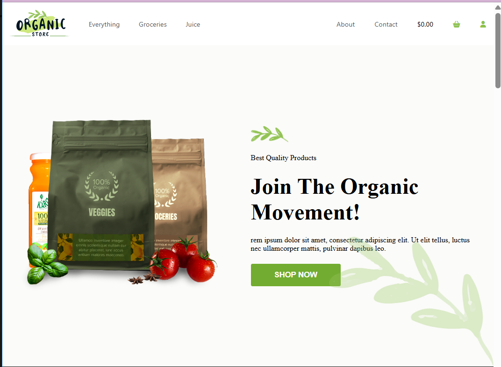

  

<h1 align="center">🌿 Organic Store – Responsive Frontend Website</h1>

  A modern, clean & responsive organic store landing page built with HTML & CSS

  <a href="#"><strong>Live Demo</strong></a> ·
  <a href="#-project-preview"><strong>Screenshots</strong></a> ·
  <a href="#-tech-stack"><strong>Tech Stack</strong></a>

## 📸 Project Preview

  

 

  <b>Responsive Design</b>

  
  
  

 

## 🛠️ Technologies Used

- **HTML5** – Structure of the website  
- **CSS3** – Styling and layout  
- **Font Awesome** – Icons  
- **Responsive Design** – Media queries for different screen sizes  

